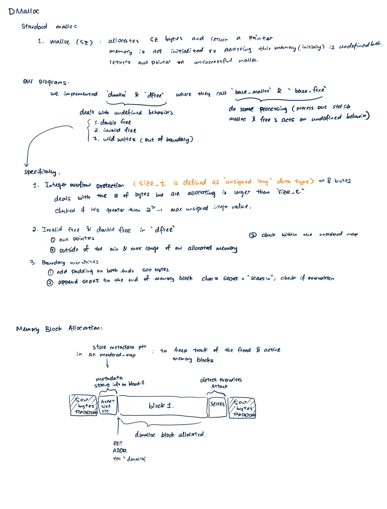

# Project: DMalloc

## Design Overview:

This project is a self implementing dynamic memory allocator - specifically, `malloc` and `free`. Within this project has a well designed memory allocation mechanism such that it spots various kinds of errors in allocating and freeing memory. There are however, certain overwrites in memory that are not detected here.
The functionalities are:

1. Track information about dynamic memory allocation.
2. Catch common memory programming errors (e.g., freeing the same block twice, trying to allocate too much memory etc).
3. Detect a write outside a dynamically allocated block (e.g., writing 65 bytes into a 64-byte piece of memory).
4. Other more general programming errors.

### Reallocation

Below are the functionalities of `void* drealloc(void* ptr, size_t sz, const char* file, long line);`:

1. It reallocate the dynamic memory pointed to by `ptr` to hold at least `sz` bytes, returning a pointer to the new block.
2. If `ptr` is `nullptr`, behaves like `dmalloc(sz, file, line)`.
3. If `sz` is 0, behaves like `dfree(ptr, file, line)`.
   My implementation simulates the `realloc` method in cpp such that it handles both 1) `sz` is larger than our current memory block and 2) `sz` is smaller than our current block size
   Specifically, if `sz` is smaller than our block-size, then we return the original ptr along with updating the size in metadata. Otherwise, our function allocates a new block such that it is sufficient for our `sz` and then use `memcpy` to copy the old content into the new block.
   

### Sanitizer

GCC/Clang AddressSanitizer and LeakSanitizer are used to address memory allocation issues, including the ones we encountered while we were implementing `dmalloc` and `dfree` - such as double free, invalid pointer, overwrites in memory blocks and diabolic memory allocation, etc.
This is a particularly useful tool in that it helps detecting memory allocation issues. Specifically, it deals with dynamic memory allocation function calls, including `malloc`, `free`, `memcpy` and more. It also detects buffer overflows and underflows. However, there are inefficiencies in the sanitizer. Specifically, the processing time with sanitizer enabled increases by 73% and the memory usage also increases by 340% according to `gavinchou`.
Overall, the GCC/Clang AddressSanitizer still remains to be a very useful tool when we are looking for memory allocation errors.
[reference: http://gavinchou.github.io/experience/summary/syntax/gcc-address-sanitizer/]
